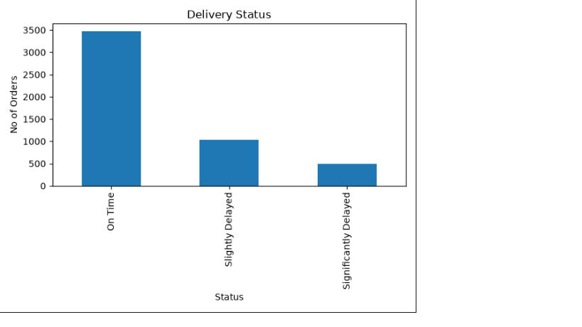
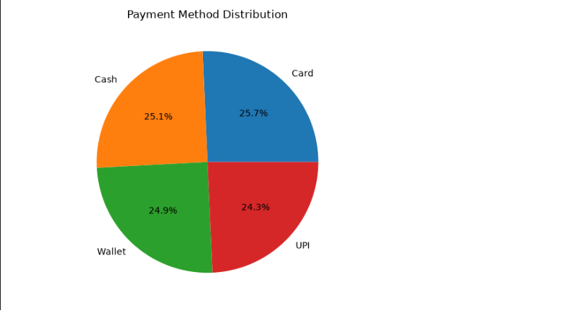
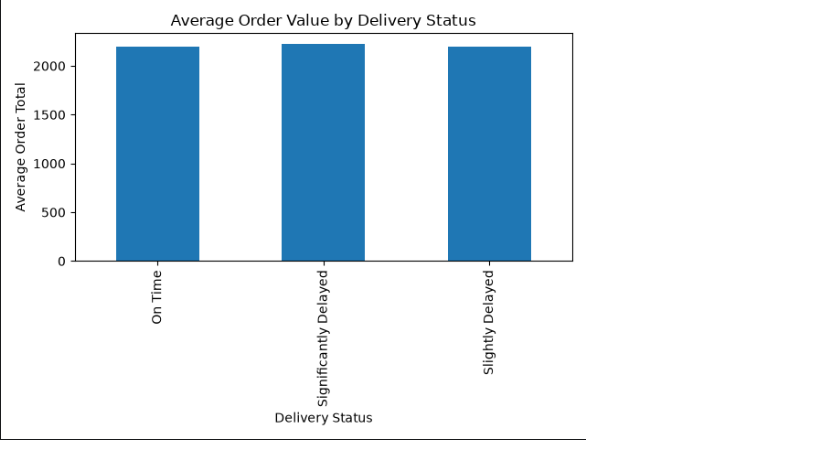
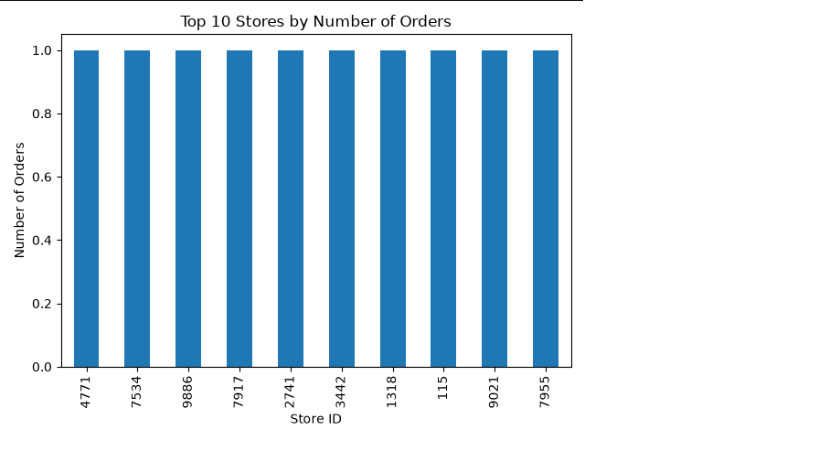
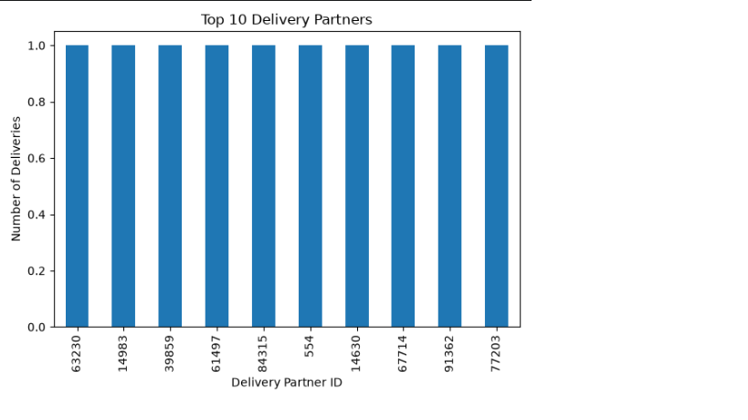
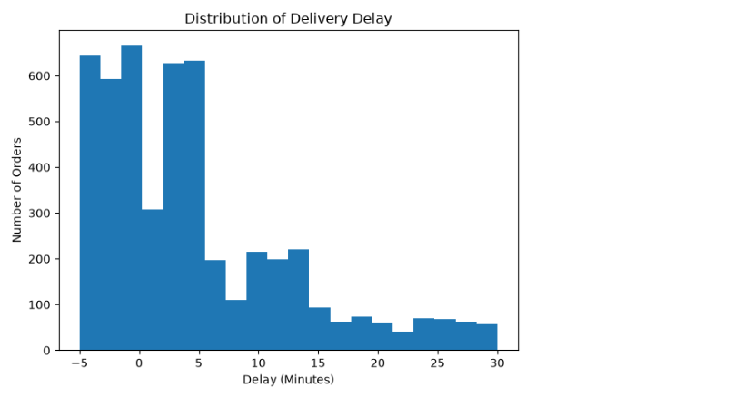
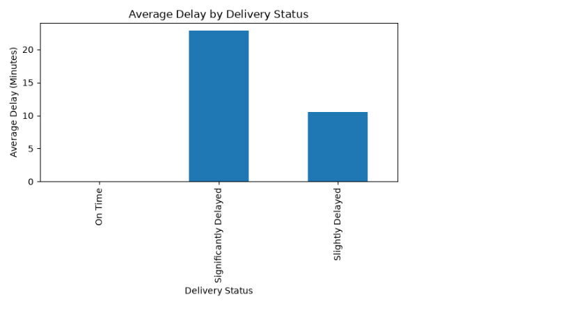
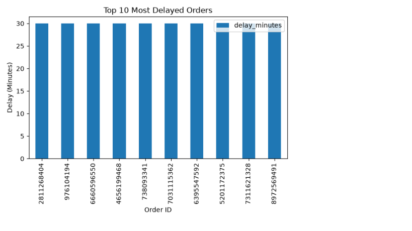
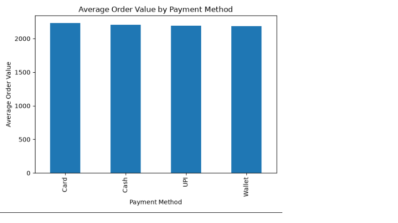
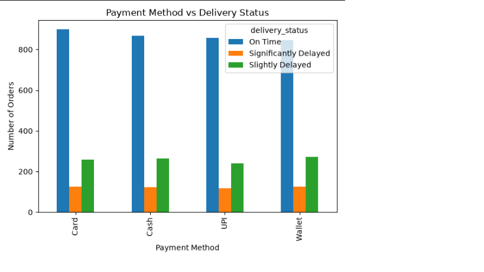

# 📊 CodeAlpha Task 3 - Data Visualization

## 🚚 Project Title

# Delivery Data Visualization using Python

---

## 📌 Project Overview

This project is completed as **Task 3 of the CodeAlpha Data Analytics Internship**.

The objective of this project is to visualize Blinkit delivery data using Python libraries and create meaningful charts to understand delivery performance, delays, payment methods, and order trends.

Data visualization helps in identifying patterns and relationships within data and makes analysis easier for better decision-making.

---

## 🎯 Objective

- Transform raw delivery data into visual insights.
- Create different charts using Python.
- Analyze trends and patterns in delivery data.
- Understand delivery performance through visualization.

---

## 🛠️ Tools & Technologies Used

- Python
- Pandas
- Matplotlib
- Seaborn

---

## 📂 Dataset

**Dataset Used:**

Blinkit Delivery Dataset

**Source:**

Kaggle

**Dataset Format:**

CSV

---

## 📊 Visualizations Created

The following visualizations were created using Python:

### 📈 Graph 1: Delivery Status Analysis

### 📊 Graph 2: Payment Method Analysis

### 📉 Graph 3: Delay Distribution

### 📈 Graph 4: Average Delay Analysis

### 📊 Graph 5: Order Value Analysis

### 📉 Graph 6: Delivery Performance Comparison

### 📊 Graph 7: Order Trend Analysis

### 🔥 Graph 8: Correlation Analysis

### 📦 Graph 9: Additional Analysis

### 📈 Graph 10: Additional Visualization

---

## 🔍 Analysis Performed

- Data loading
- Data cleaning
- Data preprocessing
- Exploratory Data Analysis
- Delivery performance analysis
- Delay analysis
- Visualization of important patterns

---

## 💡 Key Insights

- Delivery delays were identified through visualization.
- Delivery performance patterns were analyzed.
- Payment method distribution was studied.
- Order trends and values were compared.
- Visual analysis helped in understanding business insights.

---

## ⭐ Conclusion

This project demonstrates how Python visualization libraries can be used to analyze real-world delivery data.

The created charts help understand delivery performance, delays, payment methods, order values, and customer order trends, making data easier to interpret and analyze.
